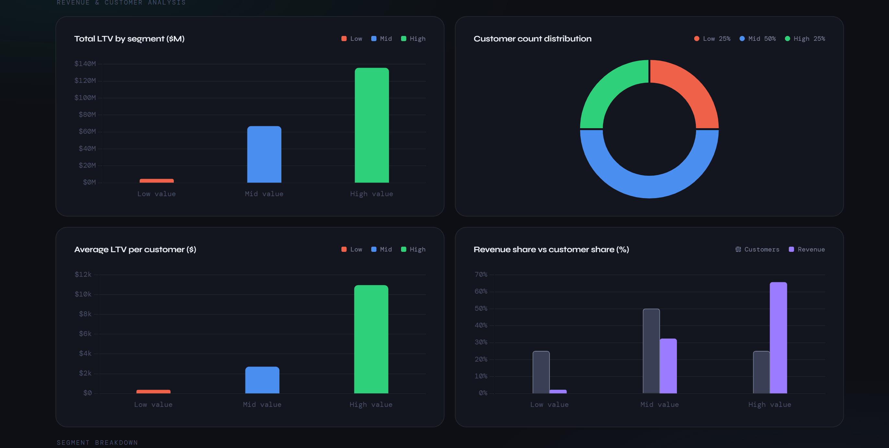
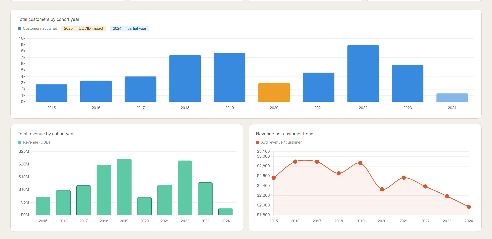
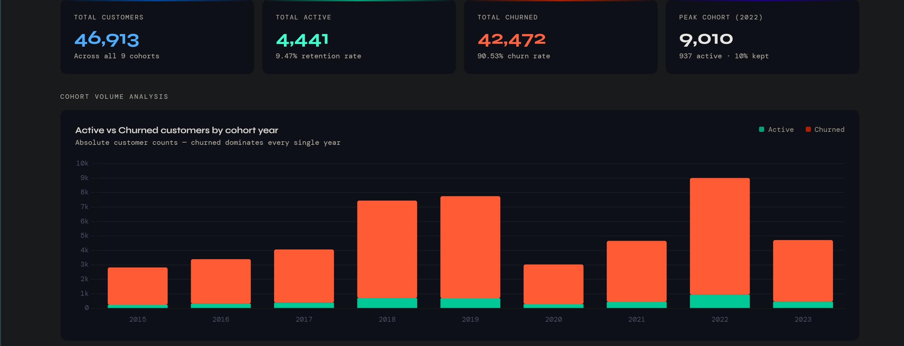

# 📊 Contoso SQL Analytics Project

SQL analytics project using the Contoso retail dataset to answer three core business questions about customer value, cohort behaviour, and retention.

**Tools:** SQL · DBeaver · VS Code · HTML Dashboards

---

## 📁 Project Structure

```
SQL-project/
├── Cohort Analysis/
├── Customer Retention/
├── Customer Segmentation/
├── Dashboards/
│   ├── Cohort Analysis/
│   ├── Customer Retention/
│   └── Customer Segmentation/
└── Tables/
```

---

## Q1 — Customer Segmentation
**Who are our most valuable customers?**

### 🔗 Dashboard
[View Dashboard](https://panigrahitarun259.github.io/SQL--project/Dashboards/Customer_Segmentation/customer_segmentation_dashboard.html)

### 📸 Screenshots



### 💡 Insights

# Customer Segmentation Analysis: Summary

## 📊 Key Revenue Insights
* **The 25/65 Rule:** High-value customers represent only **25%** of the base but generate **65.6%** of total revenue ($135.4M).
* **The LTV Chasm:** There is a massive disparity in Lifetime Value (LTV). A High-Value customer is worth **31x** more than a Low-Value customer and **4x** more than a Mid-Value customer.
* **Mid-Tier Underperformance:** While making up **50%** of the customer base, the Mid-tier contributes only **32.3%** of revenue, representing the largest untapped growth opportunity.

## 👥 Segment Breakdown
| Segment | Customer Count | Avg. LTV | Strategic Focus |
| :--- | :--- | :--- | :--- |
| **High Value** | 12,372 (25%) | $10,946 | Retention & Loyalty |
| **Mid Value** | 24,743 (50%) | $2,693 | Conversion & Upgrading |
| **Low Value** | 12,372 (25%) | $351 | Cost Reduction / Audit |

## 🚀 Strategic Recommendations
1.  **Defend the Core:** Prioritize retention and personalized experiences for the High-Value cohort to protect the primary revenue stream.
2.  **The $100M Opportunity:** Focus on "Mid-to-High" conversion. Moving just **10%** of Mid-tier customers into High-Value behavior would yield approximately **$100M** in LTV.
3.  **Efficiency Audit:** Re-evaluate the Low-Value segment. Determine if these are high-potential new leads or low-intent users to optimize servicing and acquisition costs. 
 


### 🔍 SQL Query
```sql
WITH customer_ltv AS (
	SELECT
		customerkey,
		full_name,
		sum(total_net_revenue) AS total_ltv
	FROM
		cohort_analysis
	GROUP BY
		customerkey,
		full_name
),
 
       customer_segment AS (
	SELECT
		PERCENTILE_CONT(0.25) WITHIN GROUP (
		ORDER BY
			total_ltv
		) AS ltv_25th,
		PERCENTILE_CONT(0.75) WITHIN GROUP (
		ORDER BY
			total_ltv
		) AS ltv_75th
	FROM
		customer_ltv
),
    
    segment_value AS( 
 SELECT
    c.*,
    CASE 
        WHEN c.total_ltv < cs.ltv_25th THEN '1- Low Value Customer'
         WHEN c.total_ltv <= cs.ltv_75th THEN '2- Mid Value Customer'
         WHEN c.total_ltv > cs.ltv_75th THEN '3- High Value Customer'  
       END AS customer_catogary  
 FROM 
     customer_ltv c ,
     customer_segment cs )
     
   SELECT
	customer_catogary ,
	sum(total_ltv)AS total_ltv,
	count(customerkey) AS customercount ,
	sum(total_ltv)/ count(customerkey) AS avg_ltv
FROM
	segment_value
GROUP BY
	customer_catogary
```

---

## Q2 — Cohort Analysis
**How do different customer groups generate revenue?**

### 🔗 Dashboard
[View Dashboard](https://panigrahitarun259.github.io/SQL--project/Dashboards/Cohort_Analysis/0_dashboard.html)

### 📸 Screenshots


### 💡 Insights
## 📊 Business Performance Summary

### 1. Key Metrics
* **Acquisition:** Peaked at 9,010 customers in 2022 (recovering from a 2020 dip). 2024's low drop (1,402) is likely incomplete partial-year data.
* **ARPC (Primary Concern):** Revenue per customer dropped from a 2016 peak of $2,896 to a 10-year low of $1,972 in 2024. Even high-volume years yielded below-average individual value.
* **Total Revenue:** Peaked at $22.2M in 2019. Due to the declining ARPC, the record customer volume in 2022 failed to surpass 2019's total revenue.

### 2. Strategic Bottom Line
The data reveals a divergence between volume and monetization: the business is acquiring more customers, but profitability per head is shrinking. 

**Areas for Further Investigation:**
* Increasing market price sensitivity.
* A shift in customer mix toward lower-value segments.
* Emerging competitive pressure on pricing.
 
 


### 🔍 SQL Query
```sql
SELECT
	cohort_year ,
	count(DISTINCT customerkey) AS total_customers,
	sum(total_net_revenue) AS total_revenue,
	sum(total_net_revenue)/ count(DISTINCT customerkey) AS customer_revenue
FROM
	cohort_analysis
WHERE
	orderdate = first_purchase_date
GROUP BY
	cohort_year
```

---

## Q3 — Retention Analysis
**Who hasn't purchased recently?**

### 🔗 Dashboard
[View Dashboard](https://panigrahitarun259.github.io/SQL--project/Dashboards/Customer_Retention/retention_dashboard.html)

### 📸 Screenshots


### 💡 Insights
# Retention Analysis Summary (2015–2023)

## ⚠️ The Core Problem
* **The 9% Ceiling:** Retention has remained flat at **9% for 8 years**, despite acquisition growing **3x**.
* **Leaky Bucket:** Massive growth is being neutralized by a structural failure to keep customers.
* **Internal Issue:** Churn is independent of external events (like COVID-19), suggesting a weak post-purchase experience.

## 🚀 Priority Actions
* **Identify the "Cliff":** Analyze `days_to_churn` to find the exact drop-off point (likely the first 30–60 days).
* **Trigger 2nd Purchases:** Implement automated follow-ups at **Day 7, 21, and 45**.
* **Segment Churn:** Focus win-back campaigns on high-spend customers from the last 6–12 months.
* **Structural Pull:** Introduce a **loyalty or subscription mechanic** to give customers a reason to return.

## 🎯 2024 Goal
* **KPI:** Lift retention from **9% to 15%** for new cohorts—a 66% relative improvement.
 
 


### 🔍 SQL Query
```sql
WITH customer_last_purchase AS (
	SELECT
		customerkey,
		full_name,
		orderdate,
		ROW_NUMBER() OVER (
			PARTITION BY customerkey
		ORDER BY
			orderdate DESC
		) AS rn,
		first_purchase_date,
		cohort_year 
	FROM
		cohort_analysis
),
     churned_customers AS (
     SELECT
	customerkey,
	full_name,
	orderdate AS last_purchase_date,
	CASE 
		 WHEN orderdate < (SELECT max(orderdate) FROM sales) - INTERVAL '6 months' THEN 'Churned'
		     ELSE 'Active'
	END AS customer_status,
	cohort_year 
FROM
	customer_last_purchase
WHERE
	rn = 1
AND  first_purchase_date <  (SELECT max(orderdate) FROM sales)  - INTERVAL '6 months' 	)

SELECT 
   cohort_year ,
   customer_status,
   count(customerkey) AS num_customers ,
      sum(count(customerkey)) OVER ( PARTITION BY cohort_year ) AS total_customers,
      100*(round(count(customerkey)/  sum(count(customerkey)) OVER (PARTITION BY cohort_year ),2)) AS status_percantage 
   FROM churned_customers 
 GROUP BY cohort_year, customer_status 


```
### 🤝 Let's Connect!

Whether you want to discuss the SQL scripts in this repo, talk about remote work trends, or just say hi—my inbox is open!

* 💼 **LinkedIn:** [Connect with me on LinkedIn](https://www.linkedin.com/in/tarun-panigrahi-523534325)
* 🐙 **GitHub:** [Follow my latest projects](https://github.com/Rimuru259)
* 📧 **Gmail:** [Send me an email](mailto:tarunpanigrahi259@gmail.com)
